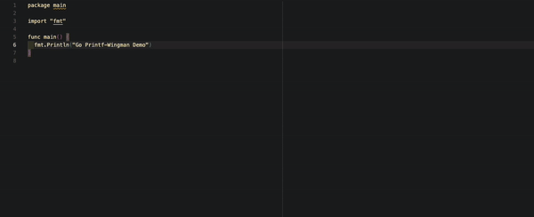

# Go Printf-Wingman

Triggers recommendations for string formatting variants in Go. The descriptions are taken from [the official documentation](https://pkg.go.dev/fmt#hdr-Printing).

Every variant that exists in Go is included in the extension. The title indicates the usage type of the variant.

> The extension is only triggered when the line includes the string `fmt` before the `%` sign.
